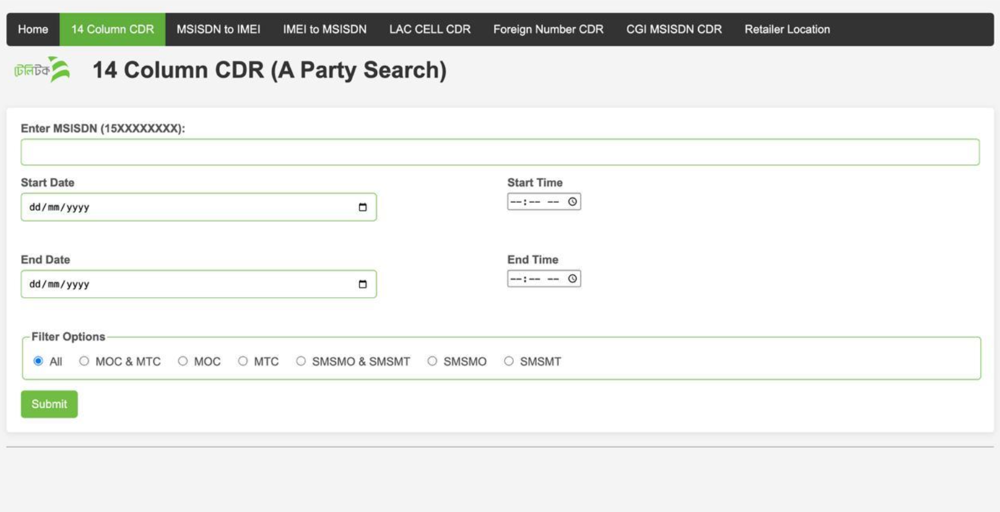
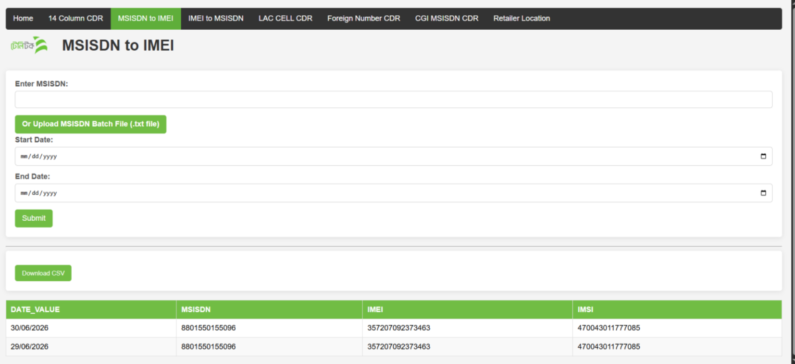
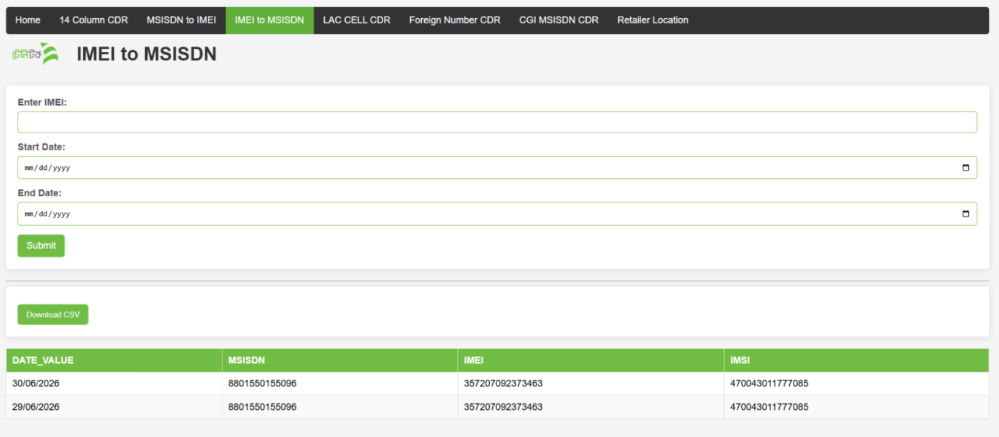
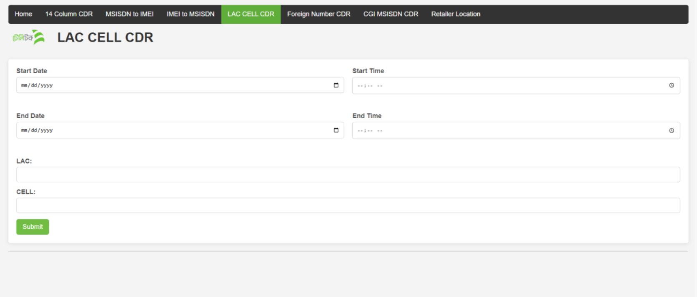
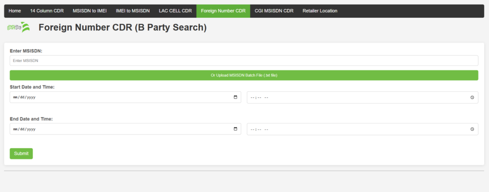
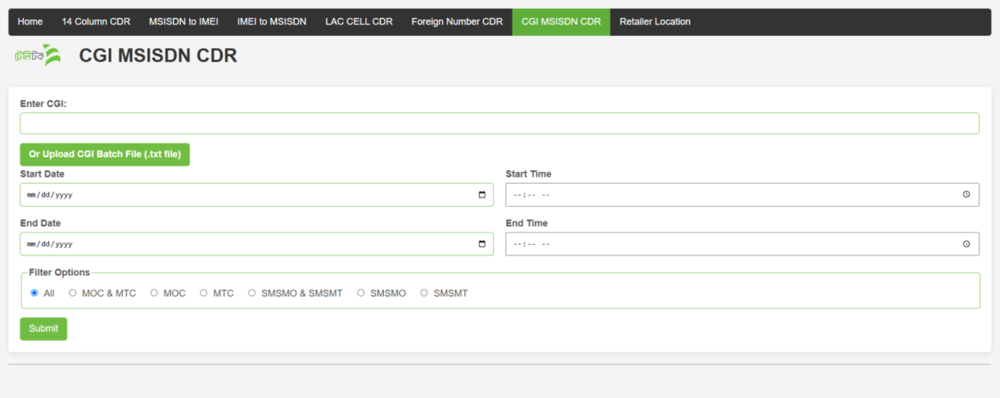
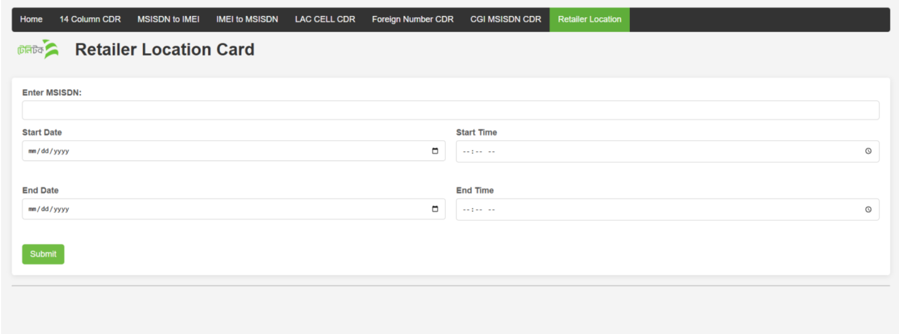
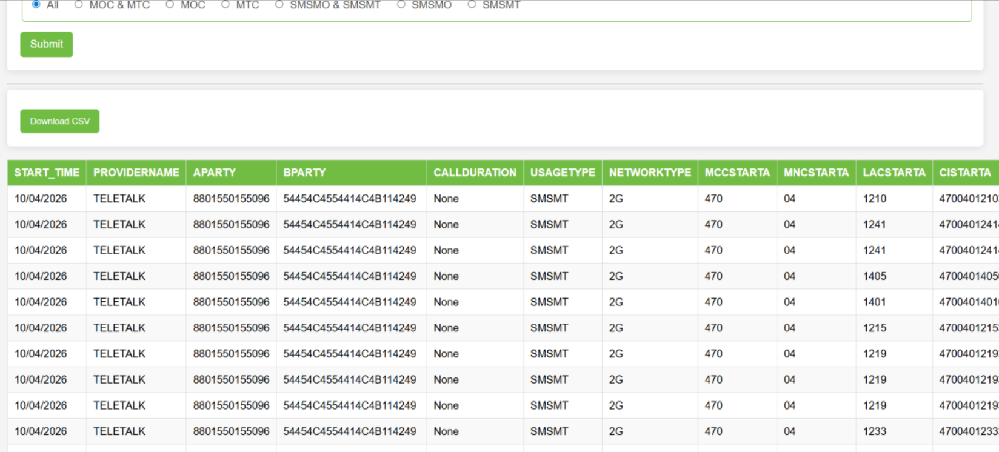

## CDR14 - Call Detail Record Portal

A Flask web app for searching telecom CDR (Call Detail Record) data from an Oracle database. Results are shown in a table and can be downloaded as CSV.

## Features

- **14 Column CDR** - search by MSISDN (A-Party)
- **Foreign Number CDR** - search by MSISDN (B-Party)
- **CGI MSISDN CDR** - search by CGI, single or batch `.txt` upload
- **LAC / CELL CDR** - search by LAC and CELL
- **Retailer Location** - site ID, site name and address for a retailer number
- **MSISDN to IMEI** and **IMEI to MSISDN** lookup
- Date + time range filter
- Usage type filter (MOC, MTC, SMSMO, SMSMT)
- CSV download

### Interface


### 14 Column CDR


### MSISDN to IMEI


### IMEI to MSISDN


 ### LAC / CELL CDR


### Foreign Number CDR


### CGI MSISDN CDR


### Retailer Location



### Result Table



## Tech Stack

Python, Flask, Oracle (python-oracledb), Pandas, HTML/CSS/JS

## Project Structure

```
CDR14/
├── app.py                  # Flask routes
├── CDR14_main.py           # Oracle connections and SQL queries
├── requirements.txt
├── .env.example
├── templates/              # HTML pages
├── static/                 # logo and assets
└── docs/screenshots/       # screenshots
```

## Installation

```bash
git clone https://github.com/<your-username>/CDR14.git
cd CDR14

python -m venv venv
venv\Scripts\activate        # Windows
source venv/bin/activate     # Linux / macOS

pip install -r requirements.txt
```

`requirements.txt`:

```
flask
oracledb
pandas
python-dotenv
```

## Configuration

Copy `.env.example` to `.env` and fill in your database details:

```env
DWH_USER=your_user
DWH_PASSWORD=your_password
DWH_DSN=host:port/service_name

IMEI_USER=your_user
IMEI_PASSWORD=your_password
IMEI_DSN=host:port/service_name

FLASK_PORT=10001
```

## Run

```bash
python app.py
```

Open http://localhost:10001 in your browser.

## Routes

| Route | Description |
|-------|-------------|
| `/` or `/14_column_cdr` | 14 Column CDR (A-Party) |
| `/foreign_number_cdr` | Foreign / B-Party CDR |
| `/cgi_msisdn_cdr` | CGI based CDR |
| `/lac_cell_cdr` | LAC + CELL based CDR |
| `/retailer_location` | Retailer location |
| `/msisdn_to_imei` | MSISDN to IMEI |
| `/imei_to_msisdn` | IMEI to MSISDN |
| `/download_csv` | Download last result as CSV |

## Output Columns

```
START_TIME, PROVIDERNAME, APARTY, BPARTY, CALLDURATION, USAGETYPE,
NETWORKTYPE, MCCSTARTA, MNCSTARTA, LACSTARTA, CISTARTA, IMEI, IMSIA, ADDRESS
```

## Usage Notes

- Set start time `00:00` and end time `23:59` to cover a full day.
- Batch file should be a plain `.txt` with one value per line.
- LAC and CELL are zero-padded automatically to build the CGI: `470 + 04 + LAC(5) + CELL(5)`.
- Large date ranges can be slow. Split them into smaller ranges.

